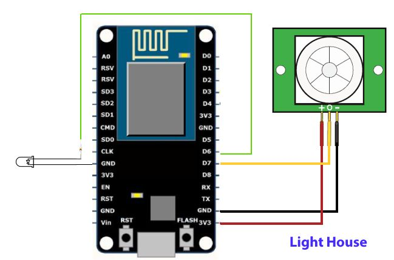
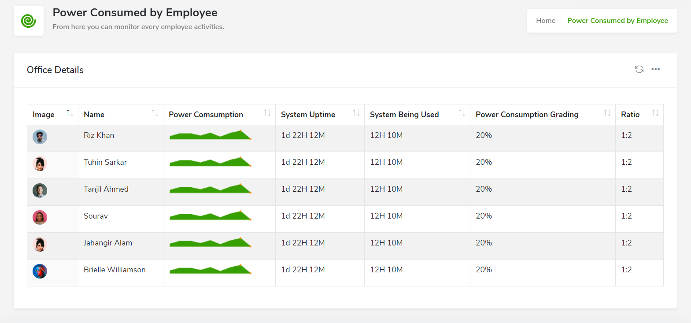

# Microsoft Code For Future

## Abstract of idea:

Smart intelligent interconnected system for best and accurate results, it is software centric so we can collect data from sensors and other methods and visualize and track usage patterns easily.
Smart/intelligent Realtime worker v/s power consumed tracker is a simple yet highly robust and useful idea, capable of solving the issue of monitoring the use of heavy power consuming devices that may lead to increase in the global carbon footprint.
Let’s quickly understand how it all works:<br>
1.	The first step would be to install an interconnected grid of PIR sensors on each workstation each of which would be connect to a centralized microcontroller<br><br>
2.	With PIR sensor we would be able to track the presence of a human Infront of his or her workstation, which would thus enable us to focus on two things, namely :
    - Human Presence Vs Power Consumed (Energy Consumed per employee)<br>
    - Human Presence Vs Work Done (Employee Performance)<br><br>
3.	Now the previously mentioned parameters are easy to predict, the amount of time human is spending Infront of his or her system when compared to the work he or she is getting done or the amount of power the system is consuming can help us in making few interesting predictions<br>
    - Worker is present for the duration system is consuming power 🡪 *All Good*
    - Worker is present for duration the system is consuming power but is lagging behind on work 🡪 *Wasting power/electricity and resources of the organisation alike*
    - Worker is not present Infront of system but the System is consuming power but he/she is not lagging behind on work 🡪 *Needs to be reprimanded ASAP* 
    - Worker is not present Infront of system but the System is consuming power but he/she is also lagging behind on work 🡪 *This needs to be dealt with seriously ASAP or dealt with some strict action*
    - Worker is present but system is not consuming power 🡪 *Again needs to be reprimanded*
    - Worker is not present and system is not consuming power 🡪 *Depending of the length of absence he/she might be on a break/gone to washroom/or taken the day off*<br><br>
4.	Now these are the few hardcoded scenarios and cases that we have come up with, but using AI, to train a model to identify optimal break lengths and washroom timeouts would result in an autonomous system that could both generate a report and at the same time manage the systems being misused<br><br>
5.	All of the previously mentioned data via the microcontroller would be sent to the backend of the application being used to keep tabs on all of this.<br><br>
6.	The application would then be able to generate reports and in depth predictions for each and every employees as well as heavy consumption electronic devices that could be reviewed on a weekly or monthly basis.<br><br>

## Quick setup guide (Hardware):

### 1.	What is a PIR sensor?

Pyroelectric / Passive InfraRed sensor: PIR sensors allow you to sense motion, generally used to detect whether a human has moved in or out of the sensors range. They are small, inexpensive, low-power, easy to use and don't wear out.
For that reason, they are commonly found in appliances and gadgets used in homes or businesses. They are often referred to as PIR, "Passive Infrared", "Pyroelectric", or "IR motion" sensors.

Output: Digital pulse high (3V) when triggered (motion detected) digital low when idle (no motion detected). Pulse lengths are determined by resistors and capacitors on the PCB and differ from sensor to sensor. Sensitivity range: up to 20 feet (6 meters) 110 degrees x 70 degrees detection range.

<br>
<br><br><br>

### 2.	Circuit Connections

Connecting **PIR** sensors to a **NodeMCU** is really simple. The PIR acts as a digital output so all you need to do is operate the pin to flip high (detected) or low (not detected). Check out the images for more details.
Most PIR modules have a **3-pin** connection at the side or bottom. The pinout may vary between modules so check the pinout carefully! Power is usually 3-5v DC input.<br><br>
The circuit connections are made as follows:<br>
- **Vcc** pin of the HC-SR501 is connected to +3v of the NodeMCU.
- **Output** pin of the HC-SR501 is connected to Digital pin D7 of the NodeMCU.
- **GND** pin of the HC-SR501 is connected to Ground pin (GND) of the NodeMCU.

<br><br><br><br>


## Quick setup guide (Software):

*Check out the live version hosted on Azure  : https://alpha-sanctuary.azurewebsites.net/* 

1. Clone the repository.
2. Inside the project directory, execute following commands.

    ```
    $ npm install
    $ npm start
    ```
3. Open the url ```http://localhost:3000/``` on web browser.

4. Sign in with the credentials 
    - Username : admin@company.com
    - Password : admin
<br><br>

- **Total Power Consumption :**

<br><br><br>

- **Power Consumption with AC and without AC:**

<br><br><br>

- **Power Consumption per Workstation :**

<br><br><br><br>

 
  


